# Kingroon KP-3の制御基板をRobinNano v2に変更した時のプリントパーツ

## 完成イメージ

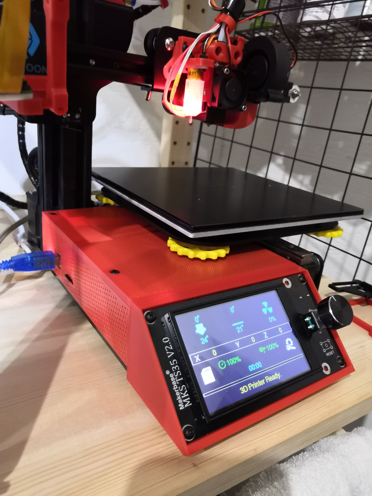

## パーツ説明

### Robin Nano V2取り付けパーツ

* PCB_base_L.stl
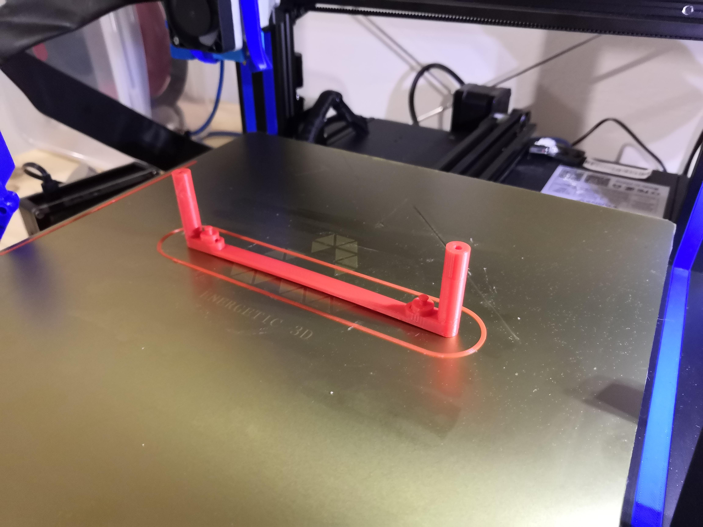
* PCB_base_R.stl
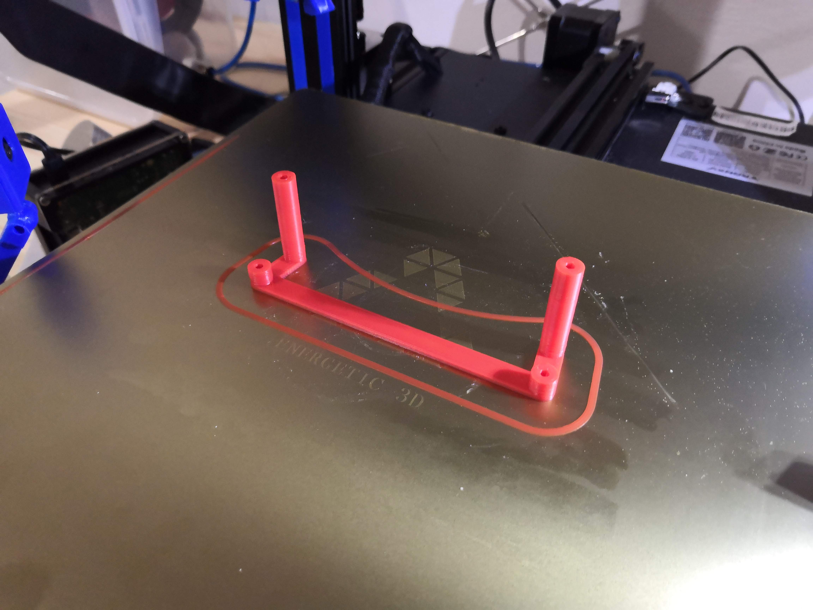

KP3の底板に、M3x12mmのビスで取り付けます。
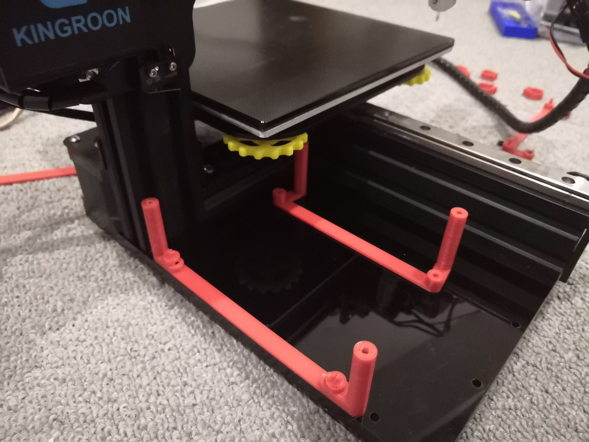
Robin Nano基板は、左側は押し込むだけ。  
右側は、M3x8mmのビスで取り付けます。

### 基板冷却ファン取り付けパーツ

* FanHolder.stl

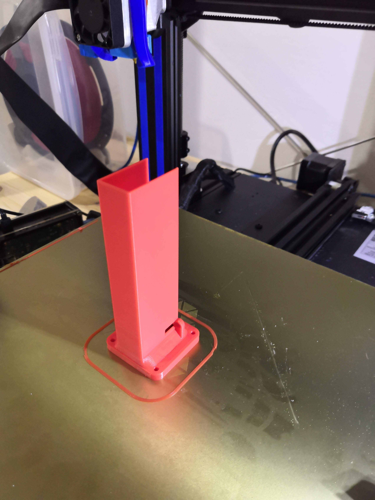

M3ビスでファンを取り付け、基板の手前左側の取り付けネジと穴を使って固定します。  
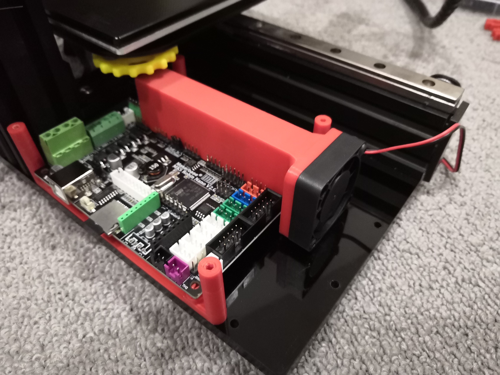

### サイドパネル

* SidePanel.stl

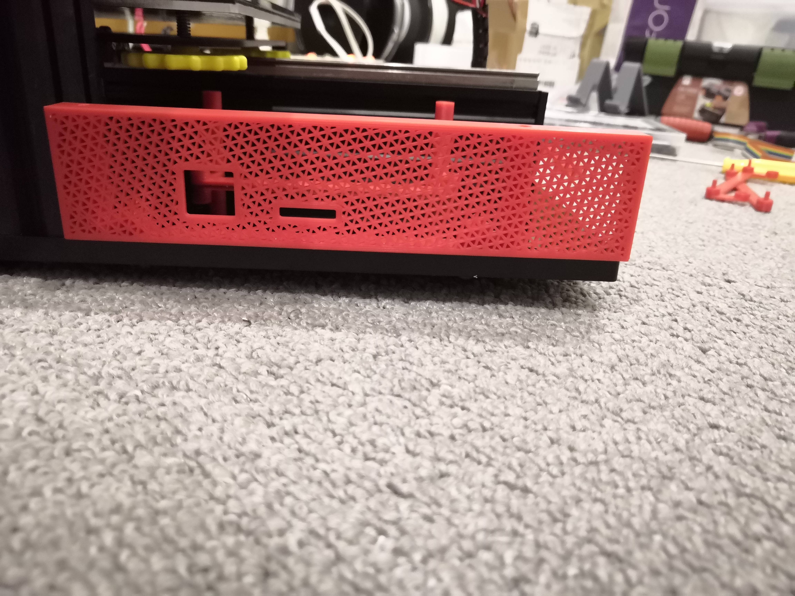

通気性をよくするために、上下面のレイヤーを0にしてインフィルむき出しでプリントしました。  
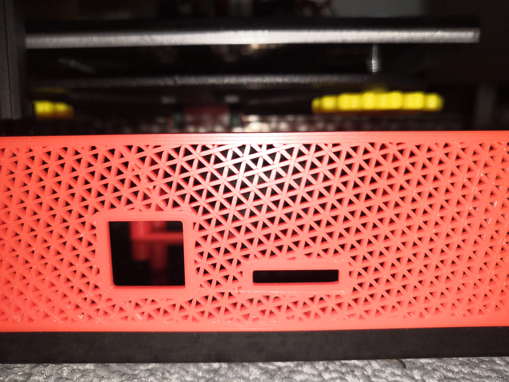

curaで、インフィル65%、トライアングル、ノズル0.6mm

### トップパネル

* TopPanel.stl

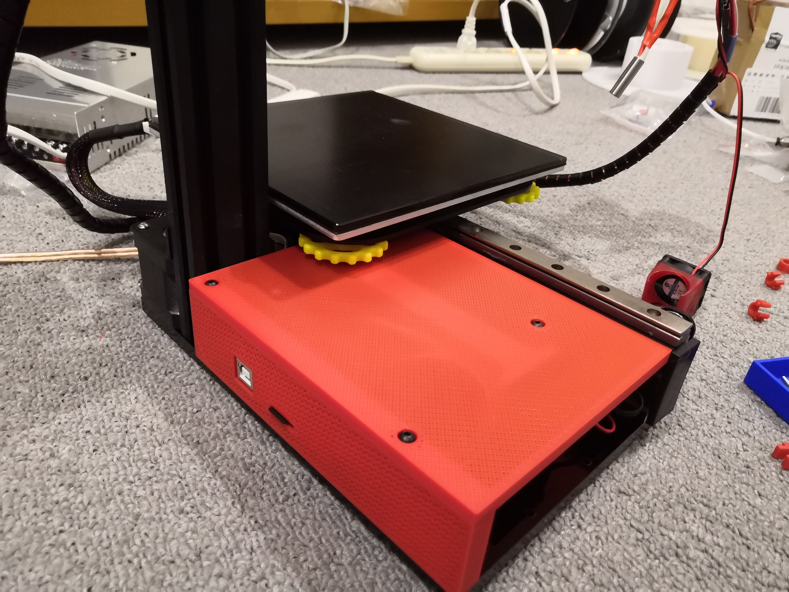

トップパネルも、インフィルむき出しメッシュにしましたが、こちらはゴミが中に入らないように目を細かくしました。  
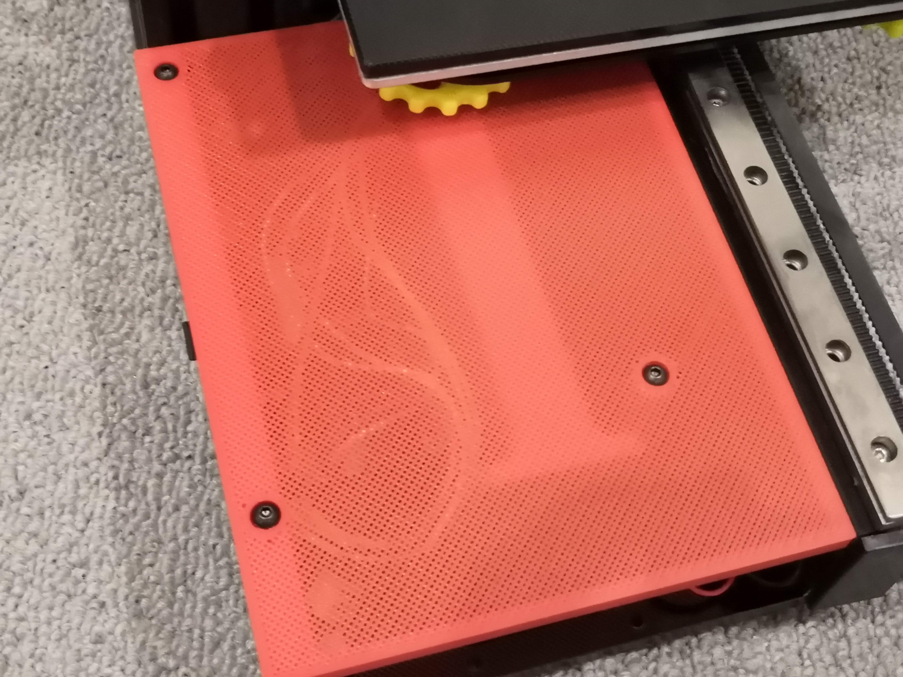

M3x8mmで、基板取り付けパーツと固定。

### LCD取り付けパーツ

* LCD_base.stl

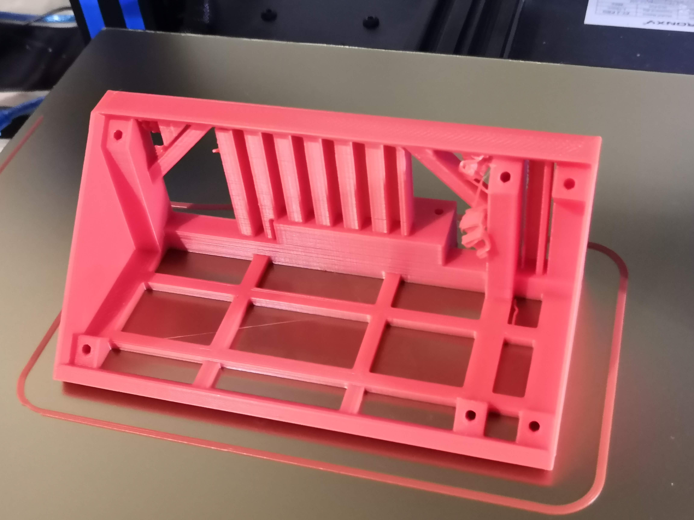  
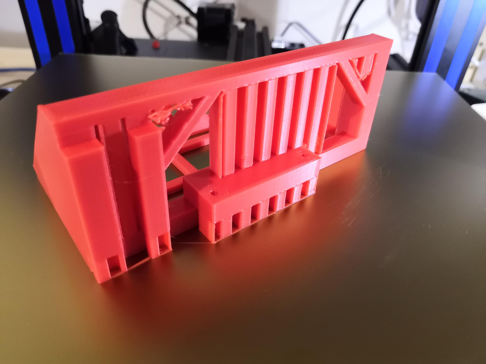  
サポートありでプリントしました。

KP3の底板に、M3x12mmで固定し、液晶パネルはM3x8mmで固定しました。  
  
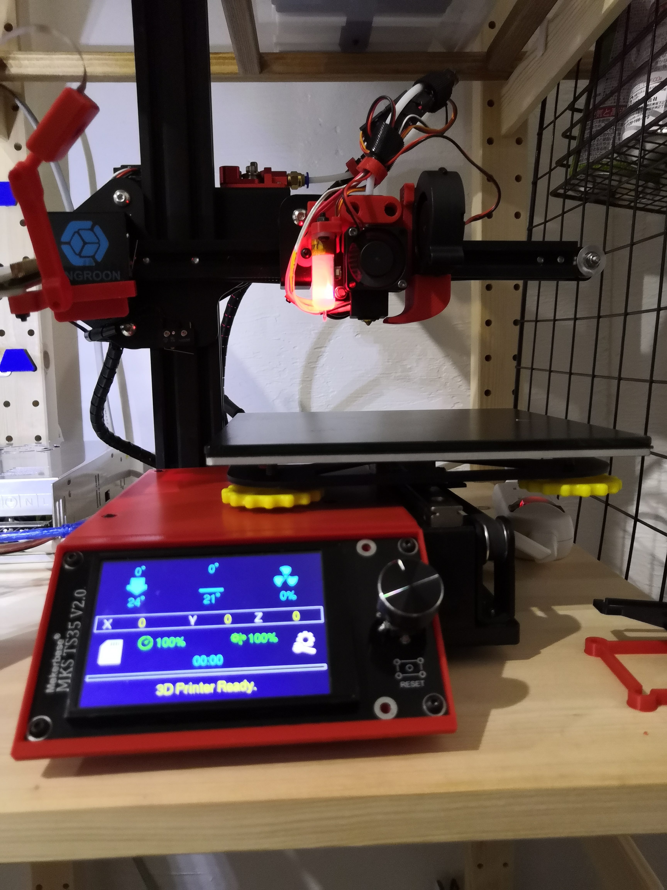  

